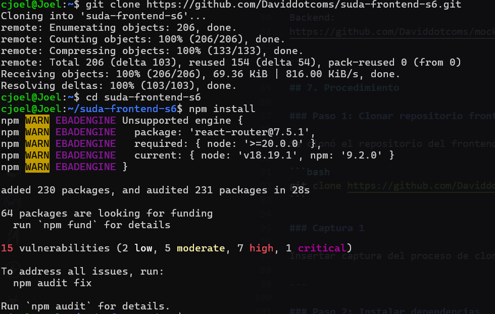
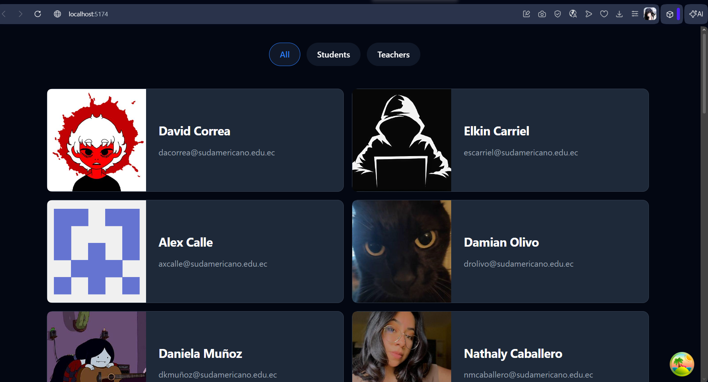
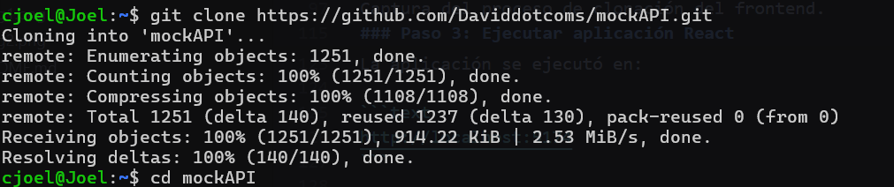
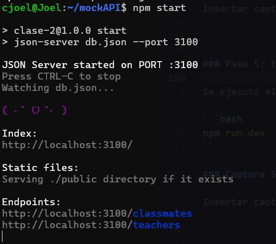
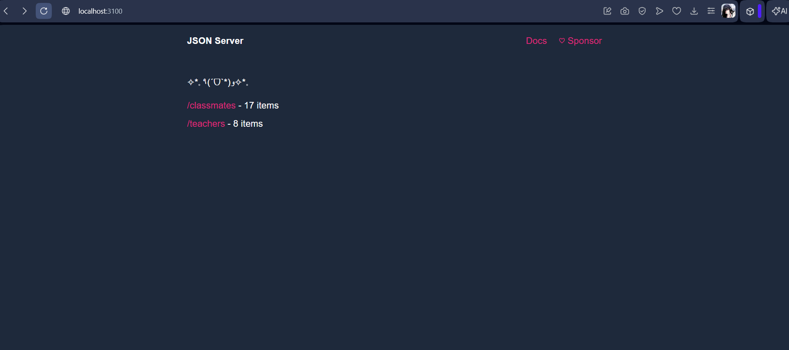
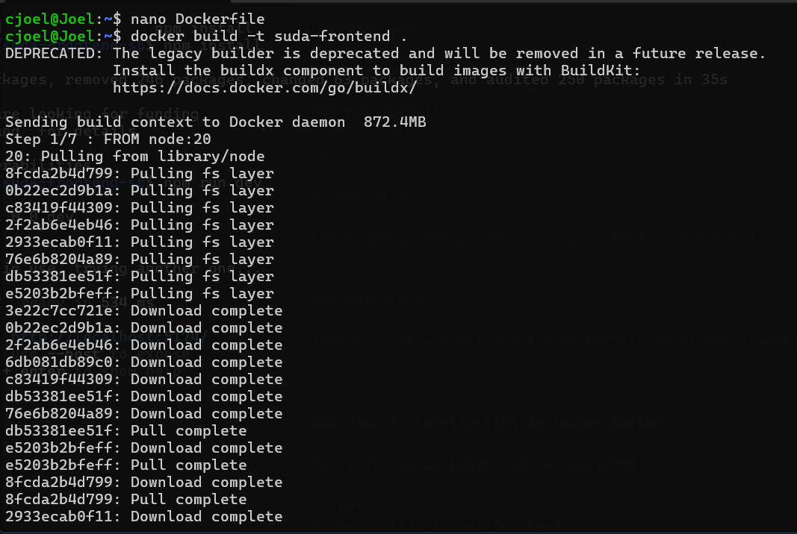
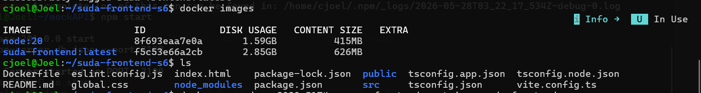
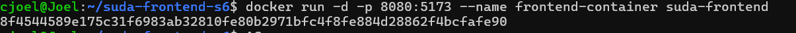
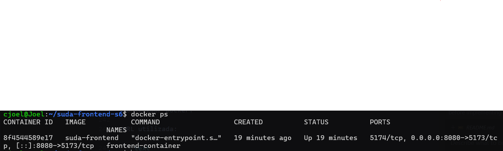
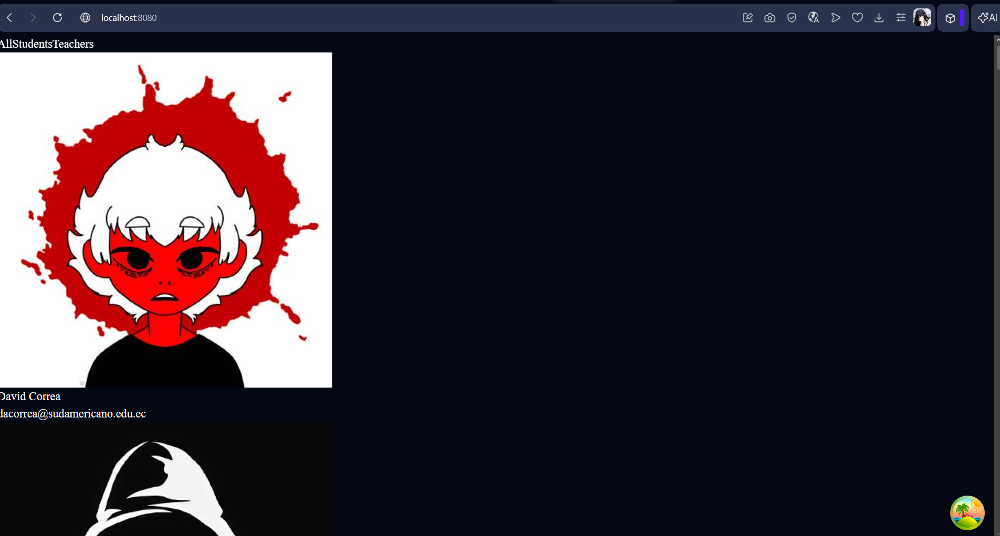

# Práctica: Dockerización de una Aplicación React

## 1. Título

Creación de una imagen Docker a partir de una aplicación React utilizando Docker y WSL.

## 2. Fundamentos

Docker es una plataforma que permite crear, desplegar y ejecutar aplicaciones dentro de contenedores. Los contenedores permiten empaquetar aplicaciones junto con sus dependencias para garantizar un funcionamiento consistente en diferentes entornos.

En esta práctica se utilizó una aplicación frontend desarrollada en React y un backend simulado mediante mockAPI. Además, se utilizó WSL (Windows Subsystem for Linux) para trabajar en un entorno Linux dentro de Windows.

También se utilizaron herramientas como:

* Docker
* Node.js
* npm
* React
* Vite
* GitHub
* WSL Ubuntu

El objetivo principal fue contenerizar la aplicación React mediante un Dockerfile y ejecutar la aplicación dentro de un contenedor Docker.

---

## 3. Conocimientos previos

* Uso básico de Linux.
* Manejo de terminal.
* Uso de Docker.
* Uso de Node.js y npm.
* Manejo básico de React.
* Uso de Git y GitHub.
* Configuración de puertos.

---

## 4. Objetivos a alcanzar

### Objetivo general

Dockerizar una aplicación React utilizando Docker y WSL.

### Objetivos específicos

* Clonar repositorios desde GitHub.
* Ejecutar una aplicación React localmente.
* Ejecutar un backend mockAPI.
* Crear un Dockerfile funcional.
* Construir una imagen Docker.
* Crear y ejecutar contenedores Docker.
* Exponer correctamente los puertos de la aplicación.

---

## 5. Equipo necesario

* Computador personal.
* Windows con WSL2.
* Ubuntu WSL.
* Docker Desktop.
* Node.js.
* npm.
* Visual Studio Code.
* Conexión a Internet.

---

## 6. Material de apoyo

* Documentación oficial de Docker.
* Documentación oficial de React.
* Guía de la asignatura.
* Repositorios GitHub proporcionados.

Frontend:
https://github.com/Daviddotcoms/suda-frontend-s6

Backend:
https://github.com/Daviddotcoms/mockAPI

---

## 7. Procedimiento

### Paso 1: Clonar repositorio frontend

Se clonó el repositorio del frontend mediante Git.

```bash
git clone https://github.com/Daviddotcoms/suda-frontend-s6.git
```

### Captura 1

Captura del proceso de clonación del frontend.

---

### Paso 2: Instalar dependencias

Se instalaron las dependencias necesarias utilizando npm.

```bash
npm install
```

### Captura 2

Insertar captura de la instalación de dependencias.

En la imgen del proceso de clonacion esta la intalacion de dependencias

### Paso 3: Ejecutar aplicación React

Se ejecutó la aplicación React utilizando Vite.

```bash
npm run dev
```

La aplicación se ejecutó en:

```text
http://localhost:5174
```

### Captura 3

Insertar captura de React funcionando localmente.

---

### Paso 4: Clonar backend mockAPI

Se clonó el backend simulado.

```bash
git clone https://github.com/Daviddotcoms/mockAPI.git
```

### Captura 4

Insertar captura de clonación del backend.

---

### Paso 5: Ejecutar backend

Se ejecutó el backend mockAPI.

```bash
npm start
```

### Captura 5

Insertar captura del backend funcionando.

---

### Paso 6: Creación del Dockerfile

Se creó un archivo Dockerfile para contenerizar la aplicación.

```dockerfile
FROM node:20

WORKDIR /app

COPY package*.json ./

RUN npm install

COPY . .

EXPOSE 5173

CMD ["npm", "run", "dev", "--", "--host", "0.0.0.0"]
```

### Captura 6

Insertar captura del archivo Dockerfile .

---

### Paso 7: Construcción de imagen Docker

Se construyó la imagen Docker mediante:

```bash
docker build -t suda-frontend .
```

### Paso 8: Verificación de imágenes Docker

Se verificó la creación de la imagen mediante:

```bash
docker images
```

### Captura 8

Insertar captura de docker images.

---

### Paso 9: Creación del contenedor Docker

Se creó y ejecutó el contenedor Docker.

```bash
docker run -d -p 8080:5173 --name frontend-container suda-frontend
```

### Captura 9

Insertar captura del comando docker run.

---

### Paso 10: Verificación del contenedor

Se verificó el estado del contenedor mediante:

```bash
docker ps
```

### Captura 10

Insertar captura de docker ps.

---

### Paso 11: Verificación final

Se verificó el correcto funcionamiento de la aplicación dentro del contenedor Docker.

URL utilizada:

```text
http://localhost:8080
```

### Captura 11

Insertar captura final de la aplicación funcionando desde Docker.

---

## 9. Resultados obtenidos

Se logró contenerizar correctamente una aplicación React utilizando Docker y WSL. La aplicación frontend logró comunicarse correctamente con el backend mockAPI y posteriormente se ejecutó exitosamente dentro de un contenedor Docker.

Además, se solucionaron problemas relacionados con:

* Configuración de puertos.
* Configuración de Vite.
* Configuración de Docker.
* Configuración de host en contenedores.

---

## 10. Conclusiones

La práctica permitió comprender el funcionamiento de Docker y la contenerización de aplicaciones React.

También se fortalecieron conocimientos relacionados con:

* Contenedores Docker.
* Imágenes Docker.
* Configuración de puertos.
* Uso de WSL.
* Configuración de aplicaciones React con Vite.

Docker facilita el despliegue de aplicaciones al permitir ejecutar software en entornos aislados y portables.

---

## 11. Bibliografía

* Docker Documentation:
  https://docs.docker.com

* React Documentation:
  https://react.dev

* Vite Documentation:
  https://vitejs.dev

* Node.js Documentation:
  https://nodejs.org

* GitHub:
  https://github.com